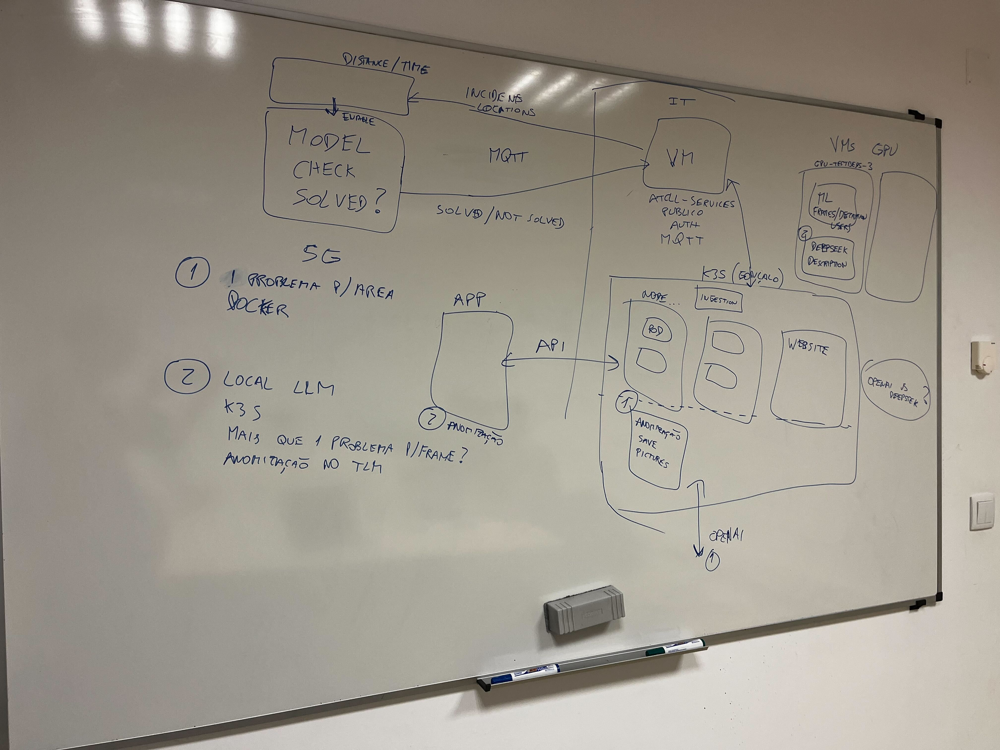

# Meeting 4 - February 20, 2025

---

## Meeting Metadata

### Date

**February 20, 2025**

### Attendees

- Danilo Micael Gregório Silva
- Pedro Miguel Azevedo Pinto
- João Pedro Azevedo Pinto
- Tomás Santos Fernandes
- Guilherme Ferreira Santos
- Professor Pedro Rito (NAP supervisor)

---

## Key Discussion Points

- **Architecture**: We discussed the architecture of the project, focusing on the integration of the different components and the data flow between them. We also addressed the challenges of integrating the image processing service directly on the **PIXKIT** and the role of the **Edge Data** in the infrastructure.

- Other topics discussed include:

#### 1. Application Development  

**Mobile App and Web App:** We presented the work done so far. Up to this point, only the static frontend has been developed.  

#### 2. Board Sketch  

Below is the classroom board sketch that outlines the planned functionalities and architecture:  

****

This diagram represents the key components and their interactions, including integration points and initial implementation priorities.  

#### 3. System Architecture

The meeting focused on discussing the proposed architecture. The main topics covered were:

- **Integration with ATCLL** (classroom board)  
- **Communication via MQTT**  
- **Definition of the communication process with PIXKIT**  
- **Equipment to be used**, including VMs to be accessed and Kubernetes clusters  

- **Machine Learning (ML)**

- Discussion on how the model will run on PIXKIT  

- **Proof of Concept**  

- Initially, we will implement the functionalities marked as number 1 in the classroom board sketch.  
- After validation, we will optimize and address the issues marked as number 2.  

- **Infrastructure and Services**

- **Kubernetes:** Definition of the required services.  
- **VMs with GPU:** Execution of Machine Learning models.  

#### 3. Next Week

- **Presentation and Deliverables**

- On Tuesday morning, we will have a presentation.  
- We agreed to send the presentation link to the group so that the Professors can provide feedback.

---

## Action Items

- **João** and **Guilherme** are responsible for the Website interface:
  - 1) Fix bugs in the first iteration
  - 2) Prepare the presentation, update the report and backlog of the project
  - 3) Review the code that Tomás and Danilo developed in the first iteration

- **Tomás** and **Danilo** are responsible for the Mobile interface:
  - 1) Fix bugs in the first iteration
  - 2) Prepare the presentation, update the report and backlog of the project
  - 3) Review the code that João and Guilherme developed in the first iteration 

- **Pedro** will complete:
  - 1) Update the architecture after the meeting, adjusting the components and the data flow
  - 2) Help in Mobile and Website bug fixing 

---

**Note**: N/A
