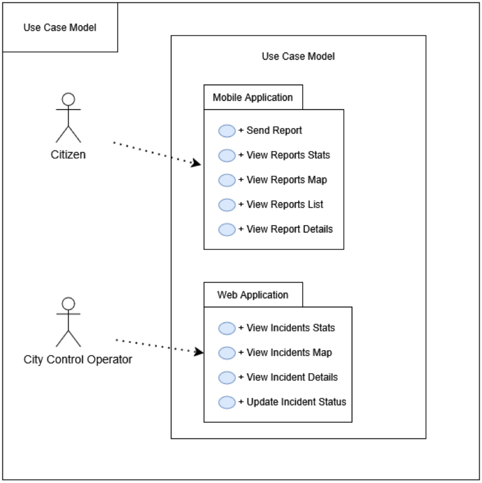
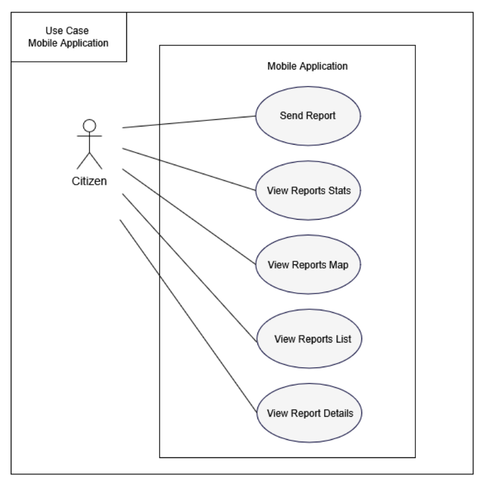
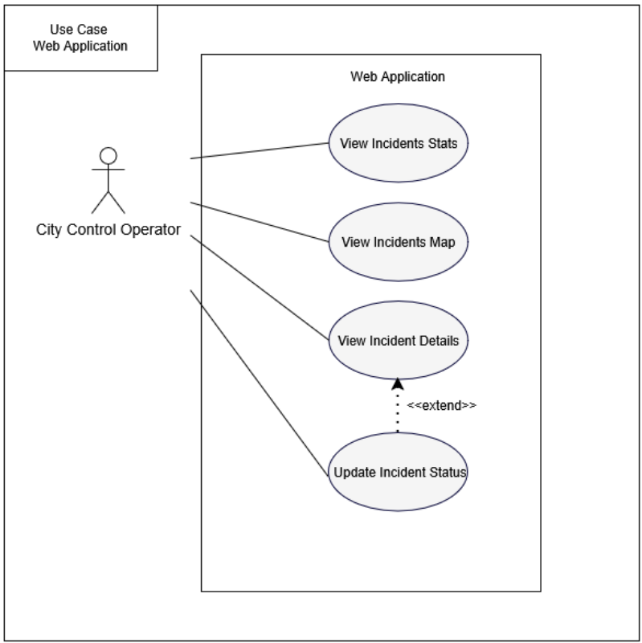

The following figure illustrates the use case model of the entire system, comprising two primary packages: the mobile application package and the web application package. These packages respectively represent the usage of the mobile and web applications.

As it can be seen, a citizen will only use the mobile application, while the city control operator solely interacts with the web application. The following subsections provide a description for each of the use cases in each package.

## Mobile Application

The mobile application use case diagram, next figure, shows the several activities the citizen can perform on their smartphone. The following list describes each use case:

- **Send Report**  
  Allows the citizen to submit an incident report using the smartphone camera and an internet connection. When the user finds an incident, they open the app and easily take a picture of the problem. Then, an AI-generated description is displayed, and the user may edit or leave the report as is before submitting it.  
  **Priority:** High

- **View Reports Stats**  
  When opening the app's Home screen, a list of statistics is displayed to users. These include the total number of reported incidents, as well as how many are pending, in progress, and resolved. This statistics list will not be updated until the citizen opens the mobile application while connected to the internet. The list of stats appears when this view of the app is accessed.  
  **Priority:** High

- **View Reports Map**  
  Allows the citizen to see all their past reports on a map view, where they can easily press the incident on the map and navigate to the incident details.  
  **Priority:** High

- **View Reports List**  
  Similar to the View Reports Map, but with a different layout. Here, the citizen can see all their past reports in a list view. Each list item links to the incident details page. To enhance usability, the citizen can also filter reports by status: pending, in progress, and resolved.  
  **Priority:** High

- **View Report Details**  
  Here, the citizen can see the details of a specific report. The details include the report's category name, reference number, submission date, status, location, and an AI-generated description.  
  **Priority:** High

## Web Application

The web application use case diagram, the following figure, shows the activities the city control operator can perform on their computer. The following list describes each use case:

- **View Incidents Stats**  
  When opening the web app's Home screen, a list of statistics is displayed to the city control operator. These include the total number of reported incidents by category, as well as how many are pending, in progress, and resolved. This statistics list will not be updated until the operator opens the web application while connected to the internet. The list of stats appears when this view of the app is accessed.  
  **Priority:** High

- **View Incidents Map**  
  Allows the operator to see all incidents on a map view, where they can easily tap on an incident and navigate to its details. They can also filter by category and select multiple categories.  
  **Priority:** High

- **View Incident Details**  
  Allows the operator to see all incidents on a map view, where they can easily tap on an incident and navigate to its details. They can also filter by category and select multiple categories.  
  **Priority:** High

- **Update Incident Status**  
  Enables the operator to modify the status of an incident, transitioning it between pending, in progress, and resolved based on its current stage.  
  **Priority:** High
